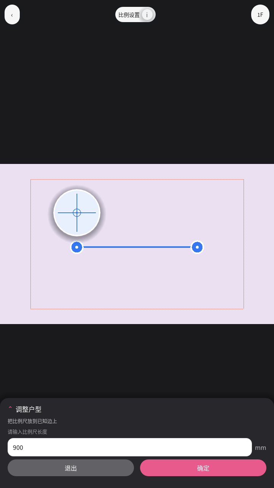
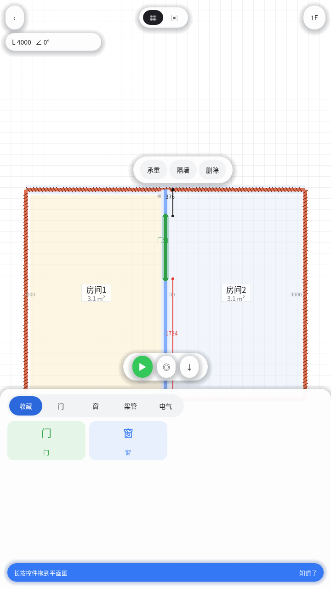
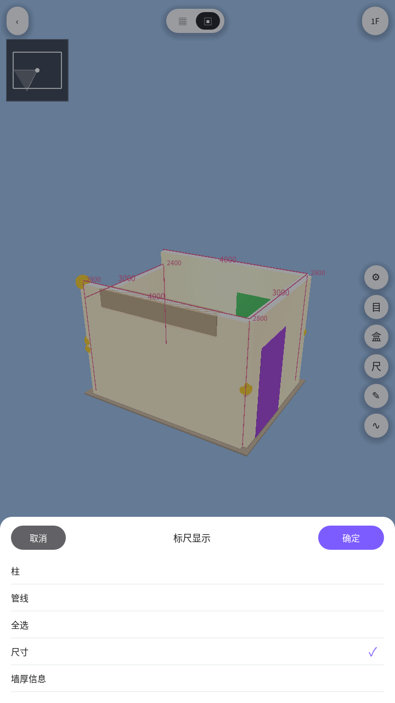
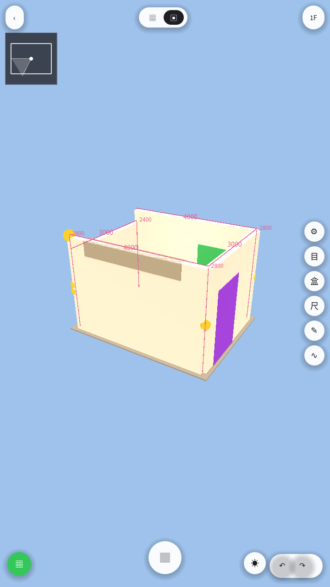
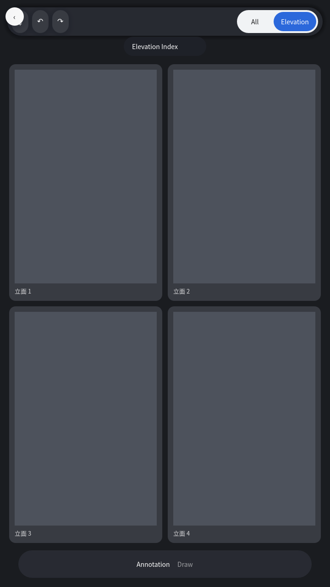

# Godot 宿主界面预览

JoyPlan 逐屏克隆：悬浮 island chrome（无通栏 / 无主 FAB）。画布由
`godot/app/capture_ui.gd` 在 Godot 4.3 `gl_compatibility` 下渲染。

| 文件 | 画面 |
|------|------|
| [01-home.png](./01-home.png) | 首页：拍户型图 / 从相册导入 / 引导量房 |
| [02-guide.png](./02-guide.png) | 引导量房 |
| [03-photo-pick.png](./03-photo-pick.png) | S1 选图：拍户型图 / 从相册导入 / 示例图 |
| [09-photo-preview.png](./09-photo-preview.png) | 选图后预览 |
| [10-calibrate.png](./10-calibrate.png) | **S2** 比例校准：顶岛、loupe、深蓝调整户型 sheet |
| [04-photo-review-kinds.png](./04-photo-review-kinds.png) | **S3** 2D：2 段 2D\|3D 胶囊、L/∠、底栏三图标、上下文 pill |
| [11-library-drag.png](./11-library-drag.png) | **S4** 底栏库 + 蓝教练 + 拖放尺寸线 |
| [05-demolish.png](./05-demolish.png) | 拆改：整段拆除 / 打断 |
| [06-shear-confirm.png](./06-shear-confirm.png) | 确认拆除承重墙 |
| [07-edit-3d-day.png](./07-edit-3d-day.png) | **S5** 3D：分离右栏圆钮、小地图 FOV、绿回 2D |
| [12-ruler.png](./12-ruler.png) | **S6** 标尺显示 sheet |
| [13-dims.png](./13-dims.png) | **S7** 空间粉红尺寸 |
| [08-edit-3d-warm.png](./08-edit-3d-warm.png) | 3D 暖光预设 |
| [14-elevation.png](./14-elevation.png) | **S8** Elevation Index stub |

## 01 首页

## 02 引导量房

## 03 拍户型图 · 导入

系统相机 / 相册；桌面为文件对话框。

## 09 照片预览

## 10 S2 比例校准

顶栏岛屿（返回 / 比例设置 / 1F）、蓝比例尺 + 圆把手、拖时圆形 loupe、
深色「调整户型」sheet（退出 / 确定，默认 900 mm）。

## 04 S3 2D 底图编辑

中间 2 段 2D|3D 胶囊；左上 L/∠；选中旁上下文 pill；底栏白胶囊三图标
（绿 3D / 指南针 / 保存）；底 1/3 素材库。

## 11 S4 底栏库拖放

蓝胶囊「长按控件拖到平面图」；拖到墙出现红/黑动态尺寸线并吸附。

## 05 拆改

## 06 承重确认

## 07 S5 3D 漫游

分离的右栏白圆、左上小地图 + FOV 锥、左下绿回 2D、右下撤销/重做。

## 12 S6 标尺显示

白 sheet：取消灰 / 确定紫；柱 / 管线 / 全选 / 尺寸 / 墙厚信息。

## 13 S7 空间尺寸

粉/红尺寸线与数字直接画在 3D 空间。

## 08 3D 暖光

## 14 S8 Elevation Index（P1 stub）

这些 PNG 由 `godot/app/capture_ui.gd` 在 Godot 4.3 `gl_compatibility` 下渲染。APK 不入库（`*.apk` gitignore）。
相机 / 相册插件说明：[godot/android-plugin/README.md](../../godot/android-plugin/README.md)。
