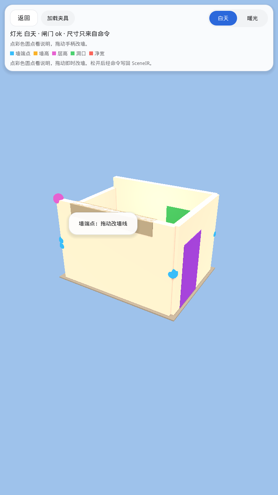

# Godot 宿主界面预览

当代手机风量房 UI：浅灰底 + 单一蓝色强调，首页大卡片进入 **拍户型图** /
**从相册导入** / **引导量房**。Android 走系统相机与相册；像素只作预览，
墙段与尺寸来自 SceneIR 命令。

| 文件 | 画面 |
|------|------|
| [01-home.png](./01-home.png) | 首页：拍户型图 / 从相册导入 / 引导量房 |
| [02-guide.png](./02-guide.png) | 引导量房：底部操作条 |
| [03-photo-pick.png](./03-photo-pick.png) | 拍户型图 / 从相册导入 / 示例图 |
| [09-photo-preview.png](./09-photo-preview.png) | 选图后预览，开始识墙 |
| [04-photo-review-kinds.png](./04-photo-review-kinds.png) | 确认承重：暖色剪力墙 + 深灰隔墙 |
| [05-demolish.png](./05-demolish.png) | 拆改：整段拆除 / 中点打断 / 局部拆除 / 打门洞 |
| [06-shear-confirm.png](./06-shear-confirm.png) | 承重墙拆除确认（底部 sheet） |
| [07-edit-3d-day.png](./07-edit-3d-day.png) | 3D 编辑 · 白天（彩色手柄 + 图例） |
| [08-edit-3d-warm.png](./08-edit-3d-warm.png) | 3D 编辑 · 暖光预设 |
| [10-edit-3d-handle-tip.png](./10-edit-3d-handle-tip.png) | 点墙端点手柄后的说明条 |

## 01 首页

## 02 引导量房

## 03 拍户型图 · 导入

系统相机 / 相册；桌面为文件对话框。不再使用“即将支持”占位。

## 09 照片预览

拍照或选图返回后先预览，再写入 `user://imports/` 并跑 FakeVision。

## 04 确认承重

FakeVisionAdapter 识别结果：四边承重/剪力墙（暖色）+ 一道砌体隔墙（深灰）。点墙切换种类。

## 05 拆改

## 06 承重确认

## 07 3D 编辑 · 白天

彩色圆点是可点可拖的手柄（蓝=墙端点、橙=墙高、紫=层高、绿=洞口、红=净宽）。
点一下出现中文说明；拖动时墙的 BoxMesh 跟着走，松开后才经命令写回 SceneIR。

## 08 3D 编辑 · 暖光

## 10 3D 编辑 · 手柄说明

点墙端点后的 HUD 说明条：「墙端点：拖动改墙线」。

这些 PNG 由 `godot/app/capture_ui.gd` 在 Godot 4.3 `gl_compatibility` 下渲染。APK 不入库（`*.apk` gitignore）。
相机 / 相册插件说明：[godot/android-plugin/README.md](../../godot/android-plugin/README.md)。
