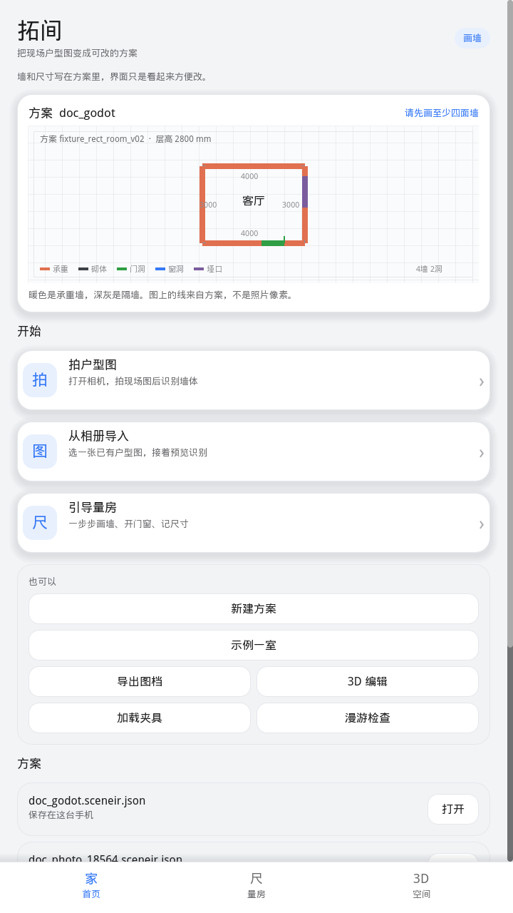
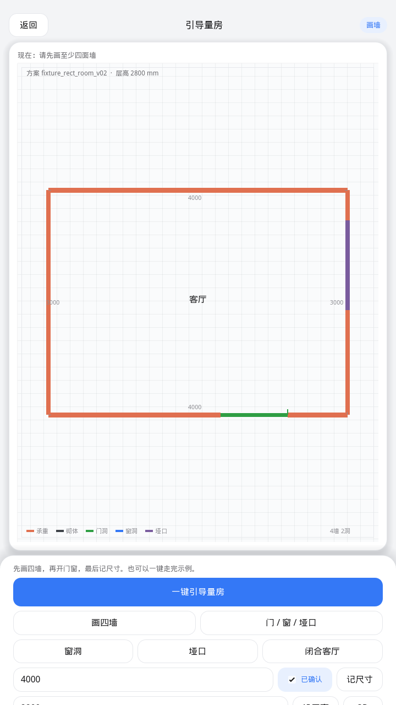
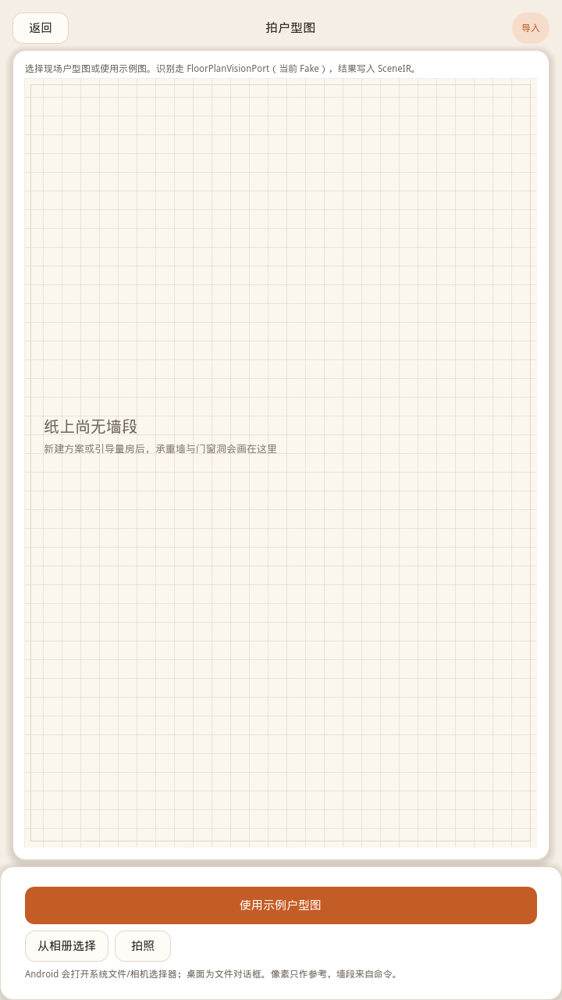
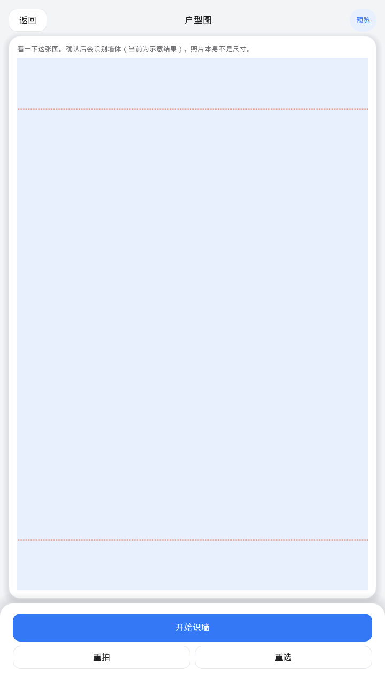
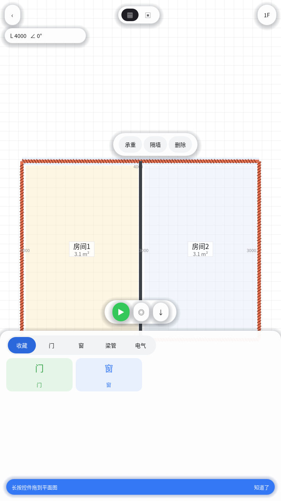
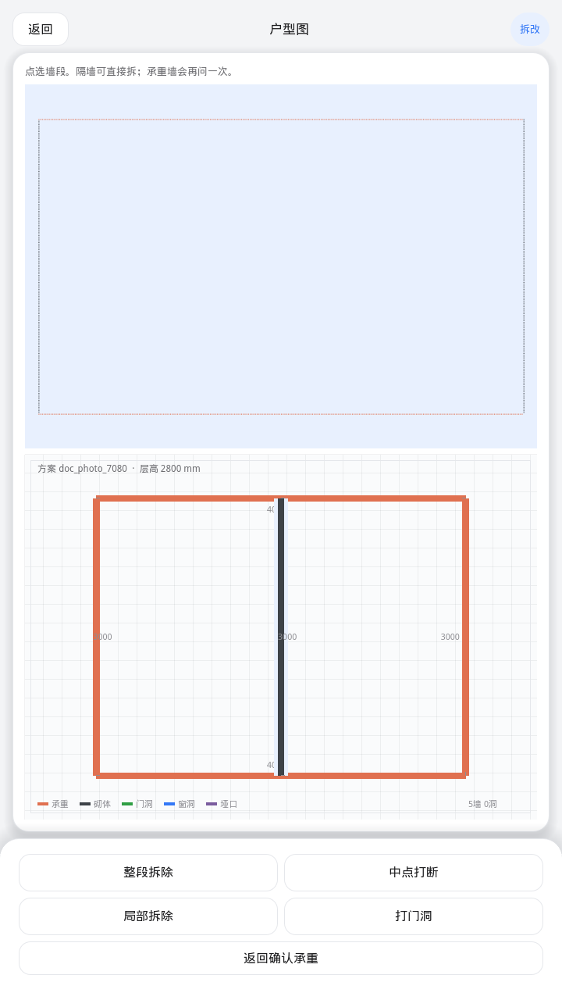
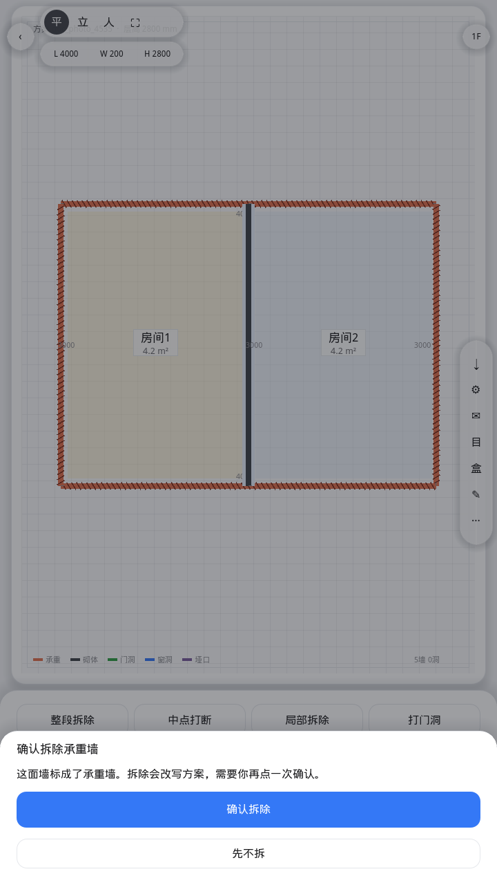
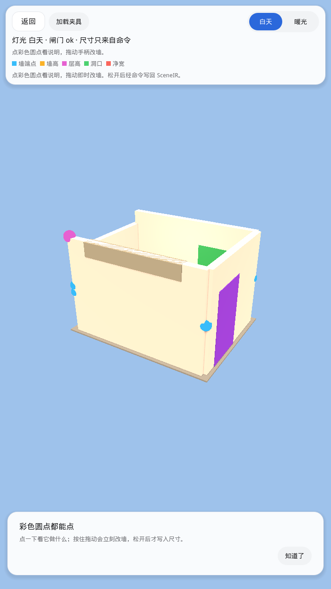
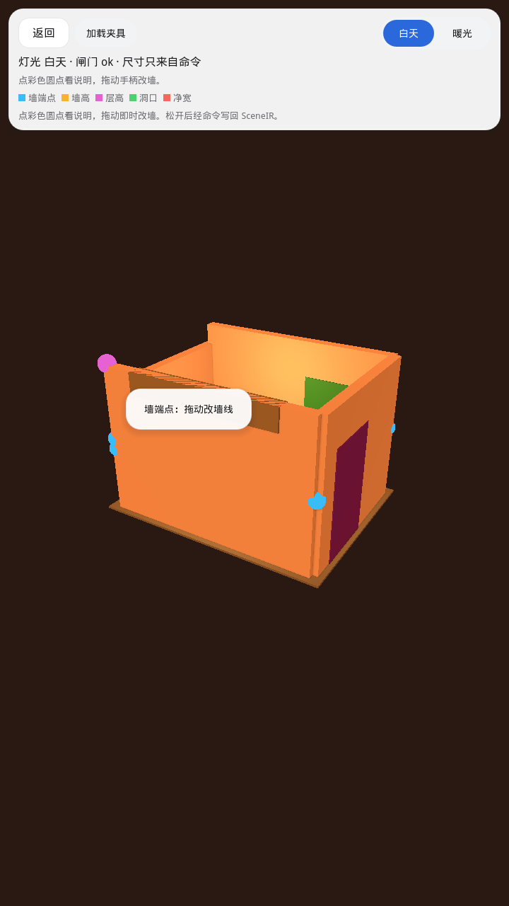

# Godot 宿主界面预览

**JoyPlan flow (current run path):** [joyplan_flow/](./joyplan_flow/) — S1–S8 floating-island chrome.

The PNGs below are the **quarantined** `_legacy/` workbench and must not be treated as the product UI.

当代手机风量房 UI：浅灰底 + 单一蓝色强调，首页大卡片进入 **拍户型图** /
**从相册导入** / **引导量房**。Android 走系统相机与相册；像素只作预览，
墙段与尺寸来自 SceneIR 命令。

| 文件 | 画面 |
|------|------|
| [01-home.png](./01-home.png) | 首页：拍户型图 / 从相册导入 / 引导量房 |
| [02-guide.png](./02-guide.png) | 引导量房：底部操作条 |
| [03-photo-pick.png](./03-photo-pick.png) | 拍户型图 / 从相册导入 / 示例图 |
| [09-photo-preview.png](./09-photo-preview.png) | 选图后预览，开始识墙 |
| [04-photo-review-kinds.png](./04-photo-review-kinds.png) | 确认承重：L/W/H chips、收藏/门/窗 库、房间 m²、FAB 3D |
| [05-demolish.png](./05-demolish.png) | 拆改：砌体直接拆；承重二次确认 copy |
| [06-shear-confirm.png](./06-shear-confirm.png) | 确认拆除承重墙（再点一次确认 / 先不拆） |
| [07-edit-3d-day.png](./07-edit-3d-day.png) | 3D 编辑 · 白天 + 底栏库 + 标尺 + FAB 2D |
| [08-edit-3d-warm.png](./08-edit-3d-warm.png) | 3D 编辑 · 暖光预设 |

## 01 首页

## 02 引导量房

## 03 拍户型图 · 导入

系统相机 / 相册；桌面为文件对话框。不再使用“即将支持”占位。

## 09 照片预览

拍照或选图返回后先预览，再写入 `user://imports/` 并跑 FakeVision。

## 04 确认承重

点墙切换种类。顶栏 L/W/H 可点进数字底栏。底栏 收藏/门/窗 长按拖放到墙。

## 05 拆改

## 06 承重确认

## 07 3D 编辑 · 白天

## 08 3D 编辑 · 暖光

这些 PNG 由 `godot/app/capture_ui.gd` 在 Godot 4.3 `gl_compatibility` 下渲染。APK 不入库（`*.apk` gitignore）。
相机 / 相册插件说明：[godot/android-plugin/README.md](../../godot/android-plugin/README.md)。
